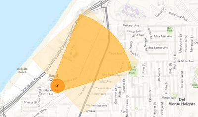

***This repository is no longer maintained. The Emergency Response Guide (ERG) widget is now releasd in [Web AppBuilder for ArcGIS](https://doc.arcgis.com/en/web-appbuilder). To understand more about the ERG widget, the documentation can be found [here](https://doc.arcgis.com/en/web-appbuilder/create-apps/widget-emergency-response-guide.htm). Issues with the Emergency Response Guide widget should be logged through [Esri Support Services](https://support.esri.com/en/).***

# ERG Widget

The Emergency Response Guide (ERG) widget allows users to determine potential hazards based on the type of chemical spill and user-selected location on the map.

[View it live](https://nationalsecurity.esri.com/solutionsweb/EmergencyResponseGuide)

The ERG widget references the [ERG Guidebook 2016](https://www.phmsa.dot.gov/hazmat/outreach-training/erg).

## Sections

* [Features](#features)
* [Instructions](#instructions)
* [Requirements](#requirements)
* [Resources](#resources)
* [Issues](#issues)
* [Contributing](#contributing)
* [Licensing](#licensing)

## Features

* Select material type
   * By Name
   * By UN/NA Number
* Select spill or container size
* Select wind direction and speed
* Select time of day the spill occurred
* Select a location on the map

## Instructions

In order to develop and test widgets you need to deploy the GRG directory to the `stemapp/widgets` directory in your Web AppBuilder installation.

## Requirements

* Minimum requirement is ArcGIS Web AppBuilder v.1.0.
* Widget has been updated to v.2.6.

## Resources
* [Web AppBuilder for ArcGIS (Developer Edition)](https://developers.arcgis.com/web-appbuilder/)
* [ArcGIS Solutions](http://solutions.arcgis.com/)
* [ArcGIS for JavaScript API Resource Center](http://help.arcgis.com/en/webapi/javascript/arcgis/index.html)
* [ArcGIS Blog](http://blogs.esri.com/esri/arcgis/)
* [twitter@esri](http://twitter.com/esri)

## Issues

Find a bug or want to request a new feature?  Please let us know by submitting an [issue](https://github.com/Esri/solutions-erg-widget/issues/new).

## Contributing

Esri welcomes contributions from anyone and everyone. Please see our [guidelines for contributing](https://github.com/esri/contributing).

If you are using [JS Hint](http://http://www.jshint.com/) there is a .jshintrc file included in the root folder which enforces this style.
We allow for 120 characters per line instead of the highly restrictive 80.

## Licensing

Copyright 2017 Esri

Licensed under the Apache License, Version 2.0 (the "License");
you may not use this file except in compliance with the License.
You may obtain a copy of the License at

   http://www.apache.org/licenses/LICENSE-2.0

Unless required by applicable law or agreed to in writing, software
distributed under the License is distributed on an "AS IS" BASIS,
WITHOUT WARRANTIES OR CONDITIONS OF ANY KIND, either express or implied.
See the License for the specific language governing permissions and
limitations under the License.

A copy of the license is available in the repository's
[LICENSE](LICENSE) file.
